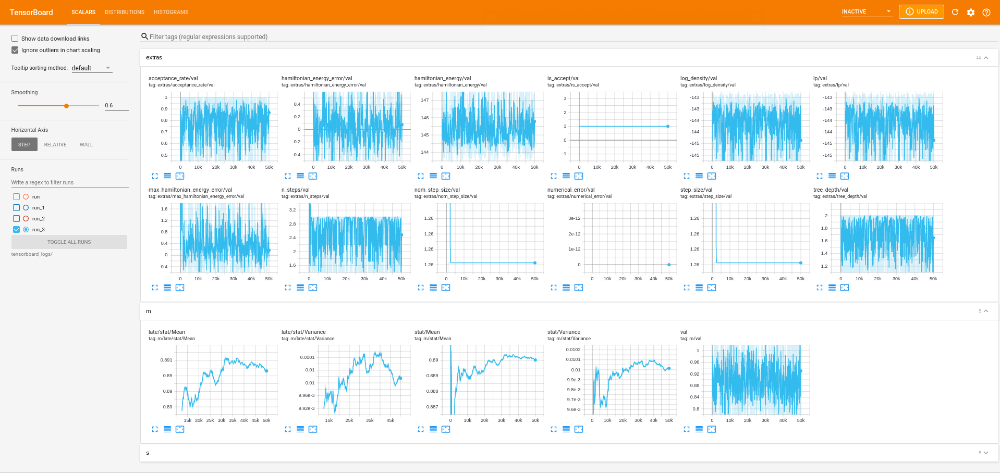

```@meta
CurrentModule = TuringCallbacks
DocTestSetup  = quote
    using TuringCallbacks
end
```

```@setup setup
using TuringCallbacks
```

# TuringCallbacks

```@contents
```

## Getting started
As the package is not yet officially released, the package has to be added from the GitHub repository:
```@example
julia> ]
pkg> add https://github.com/torfjelde/TuringCallbacks.jl
```

## Visualizing sampling on-the-fly
`TensorBoardCallback` is a wrapper around `TensorBoardLogger.TBLogger` which can be used to create a `callback` compatible with `Turing.sample`.

To actually visualize the results of the logging, you need to have installed `tensorboad` in Python. If you do not have `tensorboard` installed,
it should hopefully be sufficient to just run
```sh
pip3 install tensorboard
```
Then you can start up the `TensorBoard`:
```sh
python3 -m tensorboard.main --logdir tensorboard_logs/run
```
Now we're ready to actually write some Julia code.

The following snippet demonstrates the usage of `TensorBoardCallback` on a simple model. 
This will write a set of statistics at each iteration to an event-file compatible with Tensorboard:

```julia
using Turing, TuringCallbacks

@model function demo(x)
    s ~ InverseGamma(2, 3)
    m ~ Normal(0, √s)
    for i in eachindex(x)
        x[i] ~ Normal(m, √s)
    end
end

xs = randn(100) .+ 1;
model = demo(xs);

# Number of MCMC samples/steps
num_samples = 10_000

# Sampling algorithm to use
alg = NUTS(0.65)

# Create the callback
callback = TensorBoardCallback("tensorboard_logs/run", num_samples)

# Sample
chain = sample(model, alg, num_samples; callback = callback)
```

While this is sampling, you can head right over to `localhost:6006` in your web browser and you should be seeing some plots!



In particular, note the "Distributions" tab in the above picture. Clicking this, you should see something similar to:


And finally, the "Histogram" tab shows a slighly more visually pleasing version of the marginal distributions:


Note that the names of the stats following a naming `$variable_name/...` where `$variable_name` refers to name of the variable in the model.

### Choosing what and how you log
#### Statistics
In the above example we didn't provide any statistics explicit and so it used the default statistics, e.g. `Mean` and `Variance`. But using other statistics is easy! Here's a much more interesting example:
```julia
# Create the stats (estimators are sub-types of `OnlineStats.OnlineStat`)
stats = Skip(
    100, # Consider the first 100 steps as warm-up so we skip them
    Series(
        # Estimators using the entire chain
        Series(Mean(), Variance(), AutoCov(10), KHist(100)),
        # Estimators using the entire chain but only every 10-th sample
        Thin(10, Series(Mean(), Variance(), AutoCov(10), KHist(100))),
        # Estimators using only the last 1000 samples
        WindowStat(1000, Series(Mean(), Variance(), AutoCov(10), KHist(100)))
    )
)
# Create the callback
callback = TensorBoardCallback("tensorboard_logs/run", num_samples, stats)

# Sample
chain = sample(model, alg, num_samples; callback = callback)
```

Tada! Now you should be seeing waaaay more interesting statistics in your TensorBoard dashboard. See the [`OnlineStats.jl` documentation](https://joshday.github.io/OnlineStats.jl/latest/) for more on the different statistics, with the exception of [`Thin`](@ref), [`Skip`](@ref) and [`WindowStat`](@ref) which are implemented in this package.

Note that these statistic estimators are stateful, and therefore the following is *bad*:

```@repl setup
s = AutoCov(5)
stat = Series(s, s)
# => 10 samples but `n=20` since we've called `fit!` twice for each observation
fit!(stat, randn(10))
```
while the following is *good*:
```@repl setup
stat = Series(AutoCov(5), AutoCov(5))
# => 10 samples AND `n=10`; great!
fit!(stat, randn(10))
```

Since at the moment the only support statistics are sub-types of `OnlineStats.OnlineStat`. If you want to log some custom statistic, again, at the moment, you have to make a sub-type and implement `OnlineStats.fit!` and `OnlineStats.value`. By default, a `OnlineStat` is passed to `tensorboard` by simply calling `OnlineStat.value(stat)`. Therefore, if you also want to customize how a stat is passed to `tensorbord`, you need to overload `TensorBoardLogger.preprocess(name, stat, data)` accordingly.

#### Filter variables to log
Maybe you want to only log stats for certain variables, e.g. in the above example we might want to exclude `m` *and* exclude the sampler statistics:
```julia
callback = TensorBoardCallback(
    "tensorboard_logs/run", num_samples;
    stats = stats, exclude = ["m", ], include_extras = false
)
```
Or you can create the filter (a mapping `variable_name -> ::Bool` yourself:
```julia
var_filter(varname) = varname != "m"
callback = TensorBoardCallback(
    "tensorboard_logs/run", num_samples;
    stats = stats, variable_filter = var_filter
)
```

## Types & Functions

```@autodocs
Modules = [TuringCallbacks]
Private = false
Order = [:type, :function]
```

## Internals
```@autodocs
Modules = [TuringCallbacks]
Private = true
Public = false
```

## Index

```@index
```
